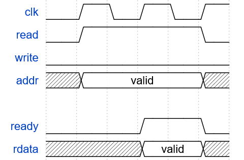
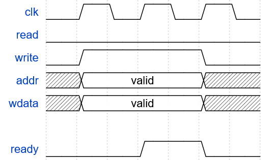

# Multicycle RISC-V CPU
This is an implementation of multicycle RISC-V CPU. It supports RV32I_Zicsr and interrupts. Tested with [RISCOF](https://riscof.readthedocs.io/en/latest/intro.html).

## Memory Interface Protocol
This CPU uses a communication protocol similar to Wishbone for it's memory transactions.
### Read

### Write
